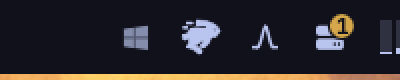

# Omarqui

An [Omarchy](https://omarchy.org/) bar widget for [Qui](https://github.com/autobrr/qui), the self-hosted qBittorrent management dashboard. See aggregate torrent speed and status at a glance, and manage torrents across all your qBittorrent instances without leaving the desktop.


### In the bar


Or as the Qui logo (`barStyle` = `Logo`), with a choice of how it shows transfer activity:



## Features

- **Bar chip** — aggregate download and/or upload speed across every qBittorrent instance Qui manages (configurable via the `barMetric` setting), with a tooltip summary
- **Logo mode** — or show the Qui logo instead of a speed (`barStyle` = `Logo`); speeds stay in the tooltip. Pick how it reacts while torrents transfer (`logoActivity`): static, pulse, dim when idle, tint in a colour of your choice, or a per-direction mark (underline halves, corner arrows, an arrow column beside the logo, or a quietly drifting arrow) in the bar colour or in download-blue / upload-green. The in-panel Settings screen previews every option as the real icon
- **Status filters** — click "active / downloading / seeding / paused / errored" to filter the list ("active" means torrents currently transferring data, i.e. non-zero download or upload speed)
- **Ratio at a glance** — each torrent row shows its share ratio (e.g. `0.82`) right next to its size
- **Instance filter** — switch between "All" and individual qBittorrent instances
- **Search** — filter by torrent name
- **Per-torrent actions** — pause, resume, delete (with a two-step confirm to avoid mistakes, and an option to delete the downloaded files too)
- **Add torrent** — paste a magnet link or a local `.torrent` file path, pick the instance and category, optionally start paused

## Requirements

- A running [Qui](https://github.com/autobrr/qui) instance
- A Qui API key (Settings → API Keys in the Qui web UI)

## Install

```bash
omarchy plugin add https://github.com/marcuspelo/omarqui.git
```

## Setup

1. Create `~/.config/omarqui/.env` with your Qui API key:
   ```
   API_KEY=your-qui-api-key
   BASE_URL=http://your-qui-host:7476
   ```
   Keeping the key in this file (outside the plugin folder) instead of `shell.json` keeps it out of any config you might sync or share. `BASE_URL` is optional but recommended: `omarchy plugin disable`/`enable` drops the widget's bar-layout entry (including whatever `baseUrl` was set via the panel or `omarchy bar set`), so a value in `.env` is what keeps working across that reset.
2. Enable the widget and point it at your Qui instance:
   ```bash
   omarchy plugin enable marcuspelo.omarqui
   omarchy bar set marcuspelo.omarqui baseUrl "http://your-qui-host:7476"
   ```
   This step is optional if `BASE_URL` is already set in `.env`.

## Security

The Qui API key never appears in process arguments: every `curl` call sends it as an HTTP header supplied over the child process's stdin (`curl -K -` with a `header = "X-API-Key: ..."` config line), not as a `-H` argument — so it's invisible to `ps`/process inspection. `~/.config/omarqui/.env` is also set to mode `0600` automatically every time the plugin reads it; you can do this yourself too: `chmod 600 ~/.config/omarqui/.env`.

## Configuration

Available settings (`shell.json`, `omarchy bar set marcuspelo.omarqui <key> <value>`, or the in-panel Settings screen — ⚙ or `s` — where every change applies as you make it):

| Setting | Type | Default | Description |
|---|---|---|---|
| `baseUrl` | string | `http://localhost:7476` | Base URL of your Qui instance (no trailing slash). Falls back to `BASE_URL` in `~/.config/omarqui/.env` when unset. |
| `refreshIntervalSec` | integer | `10` | Seconds between background refreshes (5–300) |
| `barMetric` | enum | `Download` | What the bar chip shows: `Download`, `Upload`, or `Both`. Also editable from the in-panel Settings screen. |
| `barStyle` | enum | `Speed` | `Speed` shows the chip above; `Logo` shows the Qui logo as a bar icon instead. Also editable from the in-panel Settings screen. |
| `logoActivity` | enum | `Pulse` | With `barStyle` = `Logo`, how the logo shows activity: `Static`, `Pulse` (fade in and out), `Dim` (idle at 42 %, full while transferring), `Tint` (recolour while transferring), `Underline` (left half = download, right half = upload), `Corners` (↓ bottom-left, ↑ bottom-right), `BesideUpDown` / `BesideDownUp` (arrow column next to the logo), `Drift` (one small arrow sliding in its direction). Also editable from the in-panel Settings screen. |
| `arrowColor` | enum | `Bar` | For the direction modes above: `Bar` paints the marks in the bar text colour, `State` in the widget's download blue / upload green. |
| `tintColor` | string | `accent` | For `Tint`: `accent` (theme accent), `urgent` (theme urgent), or a `#rrggbb` value. |

## Keyboard shortcuts

| Key | Action |
|---|---|
| `r` | Refresh |
| `a` | Add torrent |
| `s` | Settings |
| `esc` | Close the panel |

## Remove

```bash
omarchy plugin remove marcuspelo.omarqui
```

## License

MIT
